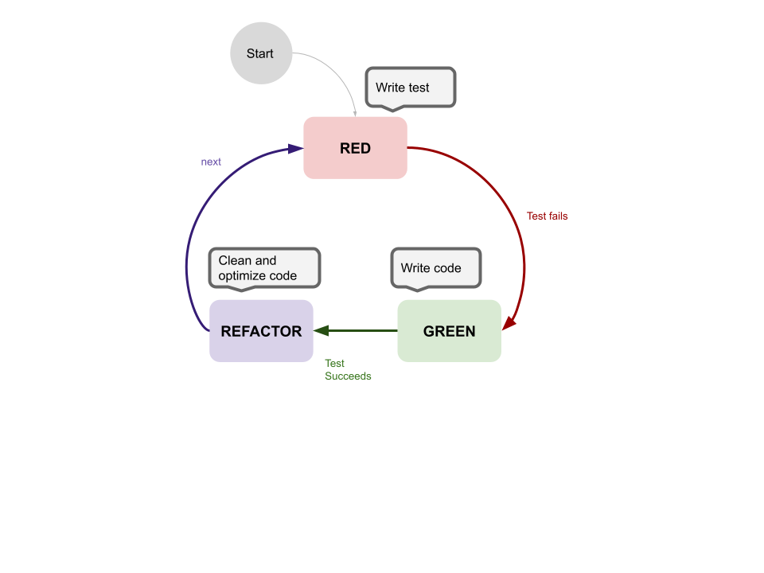
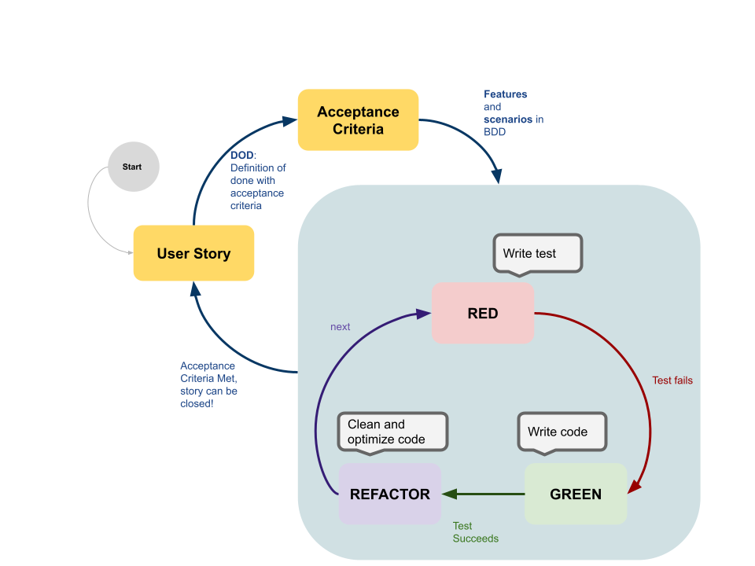
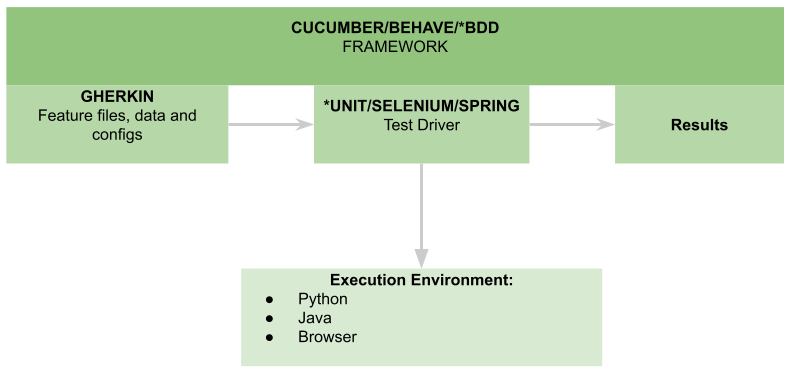

# Why you Need BDD - Behavior Driven Development
 <!-- title: Why you Need Behavior Driven Development -->
 
 
 

- [Why you Need BDD - Behavior Driven Development](#why-you-need-bdd---behavior-driven-development)
  - [Why BDD?](#why-bdd)
  - [Testing Gaps](#testing-gaps)
    - [Stop Testing Last!](#stop-testing-last)
    - [We Don't Know what to Test!](#we-dont-know-what-to-test)
  - [The Story](#the-story)
    - [Story Framework](#story-framework)
    - [The Story's Scenarios Framework](#the-storys-scenarios-framework)
- [Let's Code Behaviours!](#lets-code-behaviours)
  - [Java and Cucumber](#java-and-cucumber)
  - [Python and Behave](#python-and-behave)
- [Conclusion](#conclusion)
  - [Key Take Away](#key-take-away)
  - [References](#references)
  - [Github](#github)

## Why BDD?

BDD is a test-first paradigm that emerged from **TDD** (test driven development).

It all starts with the user and the expected behviour. You cannot go wrong here if you deliver the same requested behaviour!
</br>
For our development teams, what do all these \*DDs entail? 
</br>
TDD in its most simplest form is writing the unit test, having it fail, writing the code and finally having the test succeed with your new code. 
</br>
This is called the **Red, Green, Refactor**:

- Red − Writing a test that fails.
- Green − Writing code to pass the test.
- Refactor − Remove duplication and improve the code to the acceptable standards.



Apart from one letter, what makes BDD standout? 
</br>
It's all about *communication*. 
</br>
BDD promotes a cross-cutting conversation across all members of the squad, from product to designers and engineers. 

The memebers interacting with the users and create *stories* and *features*. These will act as *unofficial contracts* between the enduser (being external or internal) and the development team. These *contracts* get converted into executions and acceptance tests. The latter being a key outcome when working in products with multiple moving parts and contributors.




## Testing Gaps

TDD and BDD were created to prevent bad habits in testing software.

### Stop Testing Last!

BDD and its parent, TDD, all advocate testing first. 

Testing first allows you to work around tight schedules and sprints because the development  teams can focus on delivery and not testing.

Imagine sprinting across a story for two to three weeks and still being uncertain if your code is functional or delivers what is required. This won't be the case if you already have the behaviour test ready and it shields you from regression down the line.

With BDD and the shared accountability of defining and testing the behaviour you avoid falling in the negative feedback look of being unable to obtain customer satisfaction, which would also mean loss of repeated business, thus effecting credibility.

### We Don't Know what to Test!

Yes this happens, were we don't know how to assure our code.
</br>
But with BDD, we have continuous communications with our stakeholders and product teams, writing the test scenarios in unison - because it as a tech-angostic language made up of simple english (or your langaugae of choice, gherkin supports most) that is used.

No more questions of
- Where to start testing? *Outside-in, with the behvaiour.*
- What do we test? *The expected behaviour.*
- How much do we test? *Only the expected behaviour. All the acceptance criteria need to pass.*

## The Story

All great products start with an narative.

### Story Framework

We think of a **persona** that will use our software.

```
As a [Role]
I want [Feature]
so that [Benefit]
```

### The Story's Scenarios Framework

Scenarios follow this setup:

```
[Given] some initial context,
  [and] something else.
[When] an event occurs,
  [and] something else,
  [but] not this.
[Then] ensure some outcomes,
  [and] another outcome,
  [but] not not this outcome.
```

Note the concise vocabulary used. This is known as a *ubiquitous language* which enables executable requirements. Since it is ubiquitous, it is cross-functional and tech-agnostic therefore understood by everyone.

Frameworks that consume this language create Executable Specifications, Test Automation and Living Documentation.

# Let's Code Behaviours!

Assume we have this reacher **persona**'s **story**:

```
As a researcher.
I want a service that can do big number-crunching and informs me, and only me, when it is ready.
so that I can continue my work without waiting for the result.
```

We meet with the users and with our product team, we identify the following **acceptance criteria** and write this **Feature**: `Own and Run Complex Calculations without Blocking the User`

This acceptance criteria is satisfied with these **scenarios**:

```
Scenario Outline: Starting and retrieving a long calculation
  Given user with name A
  And there are 0 more result(s)
  When user A starts an addition of num1 and num2
  And user A downloads the result
  Then 1 result(s) of result is downloaded
  And there are 0 more result(s)
  Examples:
    | num1 | num2 | result |
    | 10   | 12   | 22     |
    | 120  | -20  | 100    |
      
Scenario: Can only access results of jobs they initiated
  Given user with name A
  And user with name B
  And there are 0 more result(s)
  When user A starts an addition of 10 and 12
  And user B downloads the result
  Then 0 result(s) of 22 is downloaded
  And there are 1 more result(s)
```
Out development teams will then convert these scenarios' **Steps** into **Exectuable Specifications**, preferably before they implent any code. Note the first scenario has a table, this allows multiple variations of the acceptance criteria.

All BDD frameworks operate as *test runners*, able to execute the language used to describe the story in any test framework the tech-stack offers:



## Java and Cucumber

Easiest way to use BDD in java is through Spring's configurations. let's add the required dependencies in **maven**:

```
<dependency>
  <groupId>io.cucumber</groupId>
  <artifactId>cucumber-java</artifactId>
  <version>${cucumber.version}</version>
  <scope>test</scope>
</dependency>
<dependency>
  <groupId>io.cucumber</groupId>
  <artifactId>cucumber-junit</artifactId>
  <version>${cucumber.version}</version>
  <scope>test</scope>
</dependency>
<dependency>
  <groupId>io.cucumber</groupId>
  <artifactId>cucumber-spring</artifactId>
  <version>${cucumber.version}</version>
  <scope>test</scope>
</dependency>
<dependency>
  <groupId>org.springframework.boot</groupId>
  <artifactId>spring-boot-starter-test</artifactId>
  <scope>test</scope>
</dependency>
```

Setup the project as follows:
- src
  - test
    - java
      - All our steps here.
    - features
      - all our feature files here.
    - cucumber.properties


We need to write a feature using **Gherkin**. The feature is constructed as shown above, with the *Given..When..Then* constructs.

Spring will wire our test setup as follows:


Annotate a test configuration class to allow spring to run with cucumber's test framework. In our case, this test case is an integration test using a mock webserver:

```
@CucumberContextConfiguration
@SpringBootTest(webEnvironment = SpringBootTest.WebEnvironment.RANDOM_PORT)
public class CucumberConfiguration {
  ...
}

@RunWith(Cucumber.class)
@CucumberOptions(features = "src/test/resources/features",
        plugin = {"pretty", "html:target/cucumber/test"},
        glue = {"org.adamd.tutorials", "org.adamd.tutorials.bagcommons"})
public class IntegrationTest {
}

```

key words used here are:
- **features**: where the feature files are provided.
- **glue**: where the steps have been coded and together will GLUE the scenarios.

A scenario needs to translate its steps to the executable specs. Therefore we have to create code for each step:

```
public class StepDefinitions {
    @Autowired
    private TestHttpClient testHttpClient;

    @Given("^at least (\\d+) calculation service is running$")
    public void at_least_some_calculation_service_is_running(final String userName) {
        ...
    }

    @Given("^user with name (\\S+)$")
    public void user_with_name(final String userName) {
        ...
    }

    @Given("^there are (\\d+) more result\\(s\\)$")
    public void given_there_are_more_result(final int nResults) {
        ...
    }

    // etc..
}
```

Cucumber maps variables from the steps to the functions' parameters using *regex groups*. Given that it's regex, you will need to escape your step descriptions accordingly (paranthesis, operators).

The **@Given/Then/When** take a regex which will map to the scenarios' steps. **And**s and **But**s will map to the above annotations.

Cucumber is directly linked to maven's test lifecyle: `mvn test`

The java code samples are available on [github](https://github.com/adamd1985/BDDArticle/tree/main/JavaSpring).

## Python and Behave

Behave is used for the Python framework. The concepts are the same.
</br>
We need to install the right libraries to run our calculation webservice:
- behave
- Flask
- nose

The feature files can be copied directly from java, because it is written in the **Ubiquitous language**. Gherkin is not locked to a language or tech-stack.

We will need to setup the project as follows:
- flaskr
  - Python server code here
- Features
  - Feature files here
  - steps
    - All our executable steps here.

Same as the java version, we need to code the steps. Behave has some minor syntax differences than Cucumber:

```
from behave import given, when, then


@given(u'flaskr is setup')
def flask_setup(context):
    ...


@given(u'i login with "{username}" and "{password}"')
@when(u'i login with "{username}" and "{password}"')
def login(context, username, password):
    ...


@given(u"at least {user_name} calculation service is running")
def at_least_some_calculation_service_is_running(context, user_name):
    ...

# Etc..

```
Note how Behave maps variables from the steps to the step function using `{...}` syntax.

Run your behave tests: `behave`

The python code samples are available on [github](https://github.com/adamd1985/BDDArticle/tree/main/PythonBehave).

# Conclusion

## Key Take Away

All things good with BDD:
- Fosters collaboration and communication.
- Tests/Defines what the product/feature should do, and not how it's implemented.
- Converts stories into tests, for better readability and visibility across teams.
- Meets stakeholders' expectations, through testing and therefore implementing, the wanted behaviours.
- Goes hand-in-Hand with agile frameworks (feature, story, DoDs, iterations).

## References

- Cucumber [documentation](https://docs.cucumber.io/)
- Behave [documentation](https://behave.readthedocs.io/en/stable/)

## Github

Code and article shown here are available on [github](https://github.com/adamd1985/BDDArticle).

#
<div align="right">Made with :heartpulse: by <b>Adam</b>
# BDDArticle
